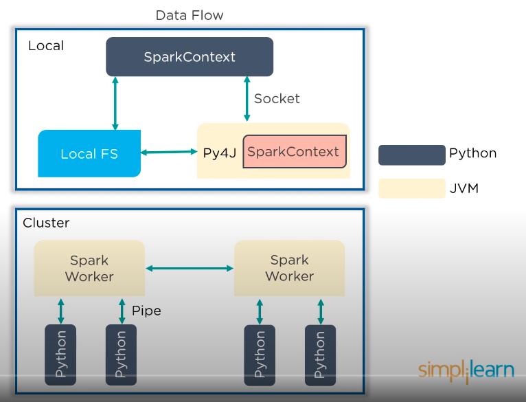

# PySpark

## Contents

* SparkConf
* SparkContext
* SparkFiles
* RDD
* StorageLevel
* DataFrames
* Broadcast & Accumalator

### SparkConf

* provides configurations to run a Spark application

  ```python
  class pyspark.SparkConf(
    loadDefaults = True,
    _jvm = None,
    _jconf = None
  )
  ```

* Some of the most commonly used attributes of SparkConf:
  * set\(key, value\) - To set a configuration property
  * setMaster\(value\) - To set the master URL
  * setAppName\(value\) - To set an application name
  * Get\(key, defaultValue=None\) - To get a configuration value of a key

    ```python
    from pyspark import SparkConf, SparkContext
    conf = SparkConf().setAppName("PySpark App").setMaster("spark://master:7077")
    sc = SparkContext(conf=conf)
    ```

### SparkContext

* main entry point in any Spark Program
* Data Flow



* PySpark class and parameters

  ```python
  class pyspark.SparkContext(
  master = None,
  appName = None,
  sparkHome = None,
  pyFiles = None,
  environment = None,
  batchSize = 0,
  serializer = PickleSerializer(),
  conf = None
  gateaway = None,
  jsc = None,
  profiler_cls = <class 'pyspark.profiler.BasicProfiler'>
  )
  ```

### SparkFiles

* allows you to upload your files using `sc.addFile` and get the path on a worker using `SparkFiles.get`
* Example

  ```python
  from pyspark import SparkContext
  from pyspark import SparkFiles
  finddistance = "/home/hadoop/examples_pyspark/finddistance.R"
  finddistancename = "finddistance.R"
  sc = SparkContext("local", "SparkFile App")
  sc.addFile(finddistance)
  print ("Absolute Path -> %s" % SparkFiles.get(finddistancename))
  ```

### RDD

* basic abstraction in Spark
* immutable, partitioned collection of elements that can be operated on in parallel
* Ops:
  * Transformation
    * such as map, filter, join, union
    * performed on RDD that yields a new RDD containg the result
  * Action
    * such as reduce, first, count
    * return value after running a computation on an RDD
* creating pyspark RDD:

  ```python
  class pyspark.RDD (
   jrdd, 
   ctx, 
   jrdd_deserializer = AutoBatchedSerializer(PickleSerializer())
  )
  ```

* pyspark program to return the number of elements in the RDD

  ```python
  from pyspark import SparkContext
  sc = SparkContext("local", "count app")
  words = sc.parallelize (
   ["scala", 
   "java", 
   "hadoop", 
   "spark", 
   "akka",
   "spark vs hadoop", 
   "pyspark",
   "pyspark and spark"]
  )
  counts = words.count()
  print ("Number of elements in RDD -> %i" % (counts))
  ```

### StorageLevel

* decides whether RDD should be stored in the memory or should it be stored over the disk, or both
* Levels:
  * **DISK\_ONLY** = StorageLevel\(True, False, False, False, 1\)
  * **DISK\_ONLY\_2** = StorageLevel\(True, False, False, False, 2\)
  * **MEMORY\_AND\_DISK** = StorageLevel\(True, True, False, False, 1\)
  * **MEMORY\_AND\_DISK\_2** = StorageLevel\(True, True, False, False, 2\)
  * **MEMORY\_AND\_DISK\_SER** = StorageLevel\(True, True, False, False, 1\)
  * **MEMORY\_AND\_DISK\_SER\_2** = StorageLevel\(True, True, False, False, 2\)
  * **MEMORY\_ONLY** = StorageLevel\(False, True, False, False, 1\)
  * **MEMORY\_ONLY\_2** = StorageLevel\(False, True, False, False, 2\)
  * **MEMORY\_ONLY\_SER** = StorageLevel\(False, True, False, False, 1\)
  * **MEMORY\_ONLY\_SER\_2** = StorageLevel\(False, True, False, False, 2\)
  * **OFF\_HEAP** = StorageLevel\(True, True, True, False, 1\)

    ```python
    from pyspark import SparkContext
    import pyspark
    sc = SparkContext (
    "local", 
    "storagelevel app"
    )
    rdd1 = sc.parallelize([1,2])
    rdd1.persist( pyspark.StorageLevel.MEMORY_AND_DISK_2 )
    rdd1.getStorageLevel()
    print(rdd1.getStorageLevel())
    ```

### DataFrames

* distributed collection of rows with named columns
* Ways to create a DataFrame in Spark
  * It can be created using different data formats
  * Loading data from existing RDD
  * Progrmatically specifying schema
* [Tutorial](https://towardsdatascience.com/the-most-complete-guide-to-pyspark-dataframes-2702c343b2e8)

### Broadcast and Accumulator

* [Tutorial](https://www.tutorialspoint.com/pyspark/pyspark_broadcast_and_accumulator.htm)
* Broadcast variable allow programmers to keep a read-only variable cached on each machine rather than shipping a copy of it with tasks
* Accumulators are variables that are only added through an associative and commutive operation
* Broadcast example:

  ```python
  from pyspark import SparkContext 
  sc = SparkContext("local", "Broadcast app") 
  words_new = sc.broadcast(["scala", "java", "hadoop", "spark", "akka"]) 
  data = words_new.value 
  print("Stored data -> %s" % (data)) 
  elem = words_new.value[2] 
  print("Printing a particular element in RDD -> %s" % (elem))
  ```

* Example of Accumulator:

  ```python
  from pyspark import SparkContext 
  sc = SparkContext("local", "Accumulator app") 
  num = sc.accumulator(10) 
  def f(x): 
   global num 
   num+=x 
  rdd = sc.parallelize([20,30,40,50]) 
  rdd.foreach(f) 
  final = num.value 
  print ("Accumulated value is -> %i" % (final))
  ```

