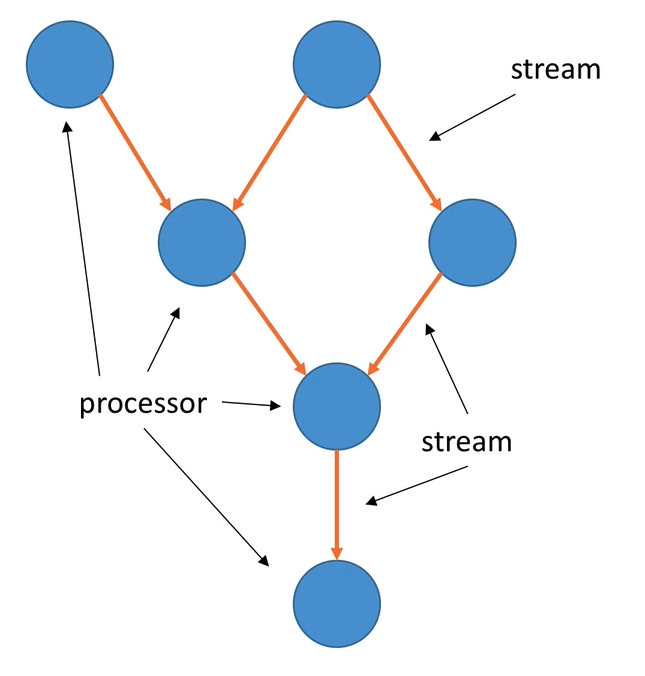
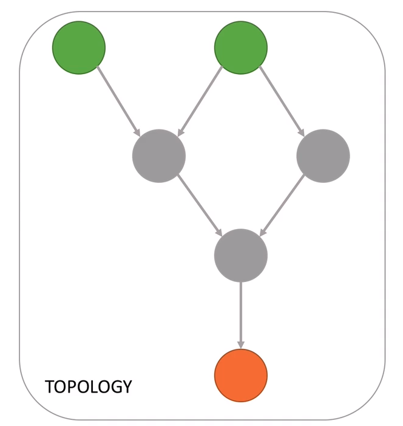

# Kafka Streams Core Concepts

## Kafka Streams Application Terminology (1/2)

* A **stream** is a sequence of immutable data records, that fully ordered, can be replayed, and is fault tolerant (think of a Kafka Topic as a parallel)
* A **stream processor** is a node in the processor topology (graph). It transforms incoming streams, record by record, and may create  new stream from it.
* A **topology** is a graph of processors chained together by streams

## Kafka Streams Application Terminology (2/2)

* a **Source processor (green)** is a special processor that takes its data directly from a Kafka Topic. It has no predecessors in a topology, and doesn't transform the data
* a **Sink processor (orange)** is processer that does not have children, it sends the stream data directly to a Kafka topic

## Kafka Streams Application

### Writing a topology

* In this course, we will leverage the **High Level DSL**
  * It is simple
  * It has all the operations we need to perform most transformations tasks
  * It contains a lot of syntax helpers to make our life easy
  * It will keep us busy for a while :smile:
  * It's descriptive
* There is also a Low level Processor API (not in this course)
  * It's an imperative API
  * Can be used to implement the most complex logic, but it's rarely needed

