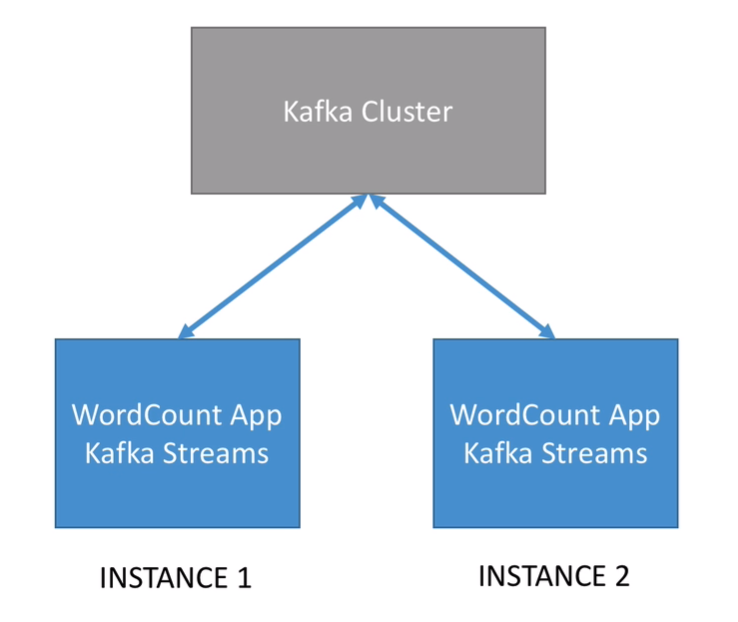

# WordCount

## Printing the Topology

* Printing the topology at the start of the application is helpful while developing (and even in production) at it helps understand the application flow directly from the first lines of he logs

* Reminder: The topology represents all the streams and procecssors of your Streams application

  ```java
  KafkaStreams streams = new KafkaStreams(builder.build(), props);
  streams.start();
  System.out.println(streams.toString());
  ```

  

## Closing the application gracefully

* Adding a shutdown hook is key to follow for a **graceful** shutdown of the Kafka Streams application, which will help the speed of restart.
* This should be in every Kafka Streams application you create

```java
// Add shutdown hook to stop the Kafka Streams threads.
// You can optionally provide a timeout to `close`
Runtime.getRuntime().addShutdownHook(new Thread(streams::close));
```


## Internal Topics

* Running a Kafka Streams may eventually create internal intermediary topics.
* Two types:
  * <u>Repartitioning topics:</u> in case you start transforming the key of your stream, a reparititioning will happen at some processor.
  * <u>Changelog topics</u> : in case you perform aggregations, Kafka Streams will save compacted data in these topics
* Internal topics:
  * Are managed by Kafka Streams
  * Are used by Kafka Streams to save / restore state and re-partition data
  * Are prefixed by `application.id` parameter
  * **Should never be deleted, altered or published to.** **<u>They are internal</u>**


## Packaging the application as a fat jar

* In order to deploy the application to other machines, we often need to compile it as a **.jar** (Java ARchive).
* Default compilation in java only includes the code you write in the .jar file, without the dependencies
* Maven has a plugin to allow us to package all our code + the dependencies int <u>one jar,</u> simply called a **fat jar**
* <u>Demo:</u>
  * Package application as a fat jar
  * Run application from the fat jar

## Scaling our application

* Our input topic has **2 partitions**, therefore we can launch up to **2 instances of our application in parallel** without any changes in the code!

* This is because a Kafka Streams application relies on **KafkaConsumer**, and we saw in the Kafka Basics course that we could add consumers to a consumer group by just running the same code.

* This makes scaling super easy, <u>without the need of any application cluster</u>

* <u>Demo:</u>

  * Ensure the source topic has partitions == number of instances we want to run (otherwise it won't work)
  * Run **two instances** of our Kafka Streams application
  * Start publishing data to the source topic
  * Observe our Kafka Streams application receive distinct data and still work!

  

