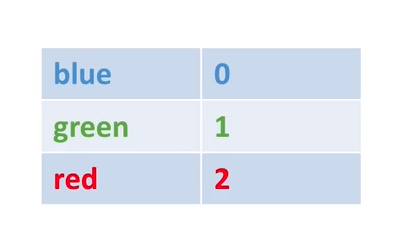

# FavouriteColour

## Practice Exercise

* Take a comma delimited topic of `userid,colour`

  * Filter out bad data
  * Keep only colour of "green", "red" or "blue"

* Get the running count of the favourite colours overall and output this to a topic

* <u>!!! A user's favourite colour can change</u>

* Example:

  * stepahane,blue
  * joh,green
  * stephane,red (update here!)
  * alice,red

  

## Guidance

* Write topology
* Start finding the right transformations to apply (see previous section)
* Creating input and output topics (and intermediary topics if you think of any)
* Feed the sample data as producer:
  * stepahane,blue
  * joh,green
  * stephane,red (update here!)
  * alice,red