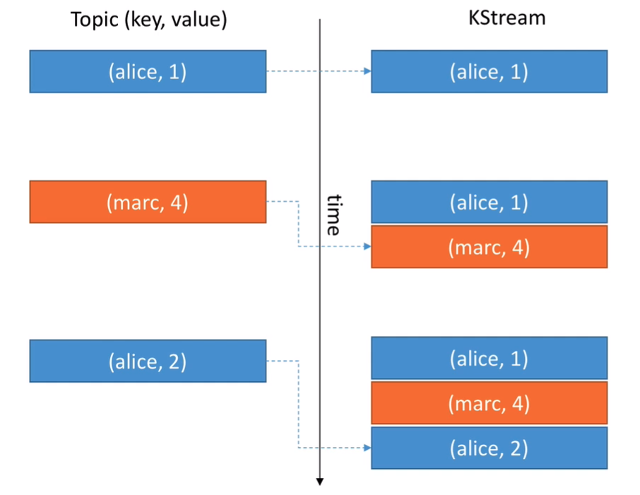
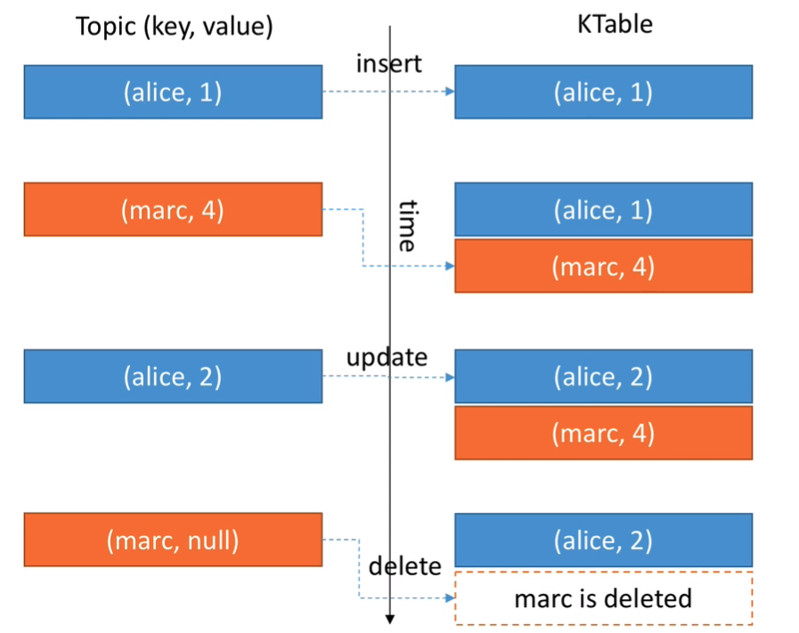
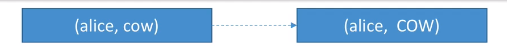
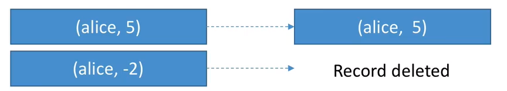
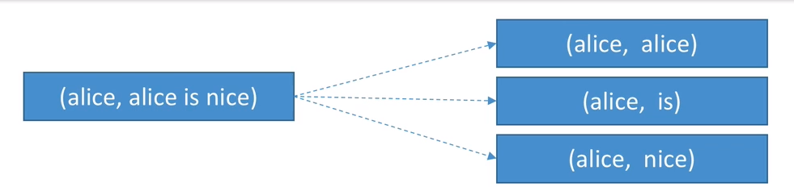
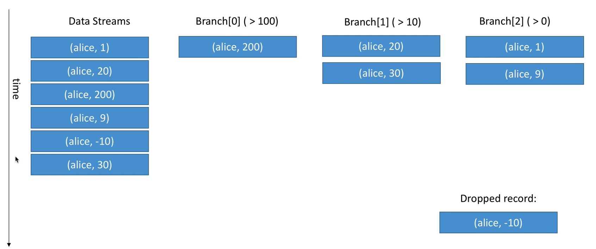
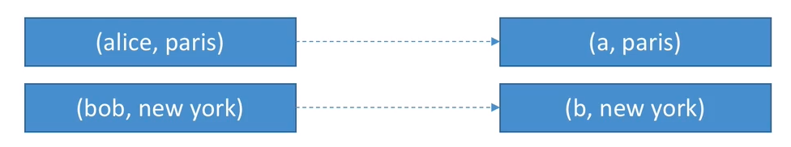
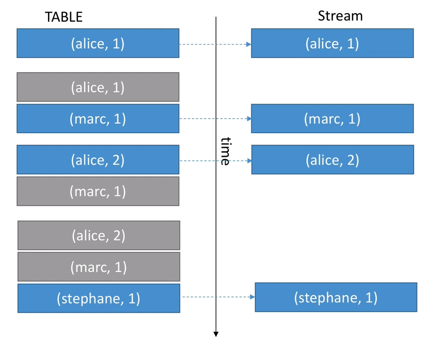
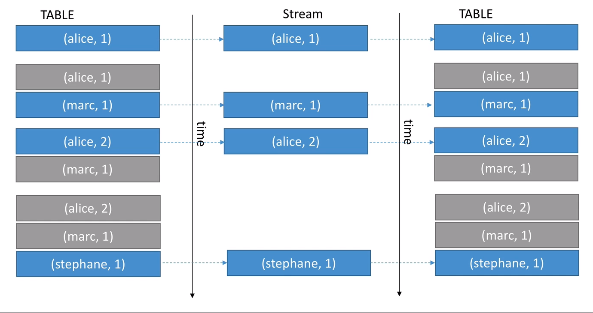

# KStreams & KTables

## Kstreams
* All **inserts**
* Similar to a log
* Infinite
* Unbounded data streams
  
  

## KTables

* All **upserts** on non null values
* Deletes on null values
* Similar to a table
* Parallel with log compacted topics



## When to use **KStreams** vs **KTable** ?

* **KStream** reading from a topic that's not compacted
* **KTable** reading from a topic that's log-compacted (aggregations)
* **KStream** if new data is partial information / transactional
* **KTable** more if you need a structure that's like a "database table", (think - total bank balance)


## Stateless vs Stateful Operations

* **Stateless** means that the result of a transformation only depends on the data-point you process
  * <u>Example:</u> a "**multiply value by 2**" operation is stateless because it doesn't need memory of the past to be achieved
  * 1 => 2
  * 300 => 600
* **Stateful** means that the result of a transformation also depends on an external information - the **state**
  * <u>Example:</u> a **count operation** is stateful because your app needs to know what happened since it started running in order to know the computation result
  * hello => 1
  * hello => 2


## MapValues / Map

* Takes one record and produces one record

* **MapValues**

  * Is only affecting values
  * == does not change keys
  * == does not trigger a repartition
  * For KStreams and KTables

* **Map**

  * Affect both keys and values
  * Triggers a re-partitions
  * For KStreams only

  ```java
  // Java +8 example, using lambda expression KStream<byte[], String>
  uppercased = stream.mapValues(value -> value.toUpperCase());
  ```



## Filter / FilterNot

* Takes one record and produces zero or one record

* **Filter**

  * does not change keys / values
  * == does not trigger a repartition
  * For KStreams and KTables

* **FilterNot**

  * Inverse of Filter

  ```java
  KStream<String, Long> onlyPositives = stream.filter((key, value) -> value > 0);
  ```

  

## FlatMapValues / FlatMap

* Takes one record and produces zero, one or more record

* **FlatMapValues**

  * does not change keys
  * == does not trigger a repartition
  * For KStreams only

* **FlatMap**

  * Change keys
  * == triggers a repartitions
  * For KStreams only

  ```java
  words = sentences.flatMapValues(value -> Arrays.asList(value.split("\\s+")));
  ```

  


## KStream Branch

* Branch (split) a KStream based on one or more predicates
* Predicates are evaluated in order, if no matches, records are dropped
* You get multiple KStream as a result

```java 
KStream<String, Long>[] branches = stream.branch(
	(key, value) -> value > 100,
	(key, value) -> value > 10,
	(key, value) -> value > 0);
```



 ## SelectKey

* Assigns a new Key to the record (from old key and value)
* == marks the data for re-partitioning
* Best practice to isolate that transformation to know exactly where the partitioning happens.

```java
rekeyed = stream.selectKey((key, value) -> key.substring(0, 1));
```




## Reading from Kafka

* You can read a topic as a KStream, a KTable or a GlobalTable

```java
KStream<String, Long> wordCounts = builder.stream(
		Serdes.String(), /* key serde */
		Serdes.Long(), /* value serde */
		"word-counts-input-topic" /* input topic */);
```

```java
KTable<String, Long> wordCounts = builder.table(
		Serdes.String(), /* key serde */
		Serdes.Long(), /* value serde */
		"word-counts-input-topic" /* input topic */);
```

```java
GlobalKTable<String, Long> wordCounts = builder.globalTable(
		Serdes.String(), /* key serde */
		Serdes.Long(), /* value serde */
		"word-counts-input-topic" /* input topic */);
```


## Writing to Kafka

* You can write any KStream or KTable back to Kafka
* If you write a KTable back to Kafka, think about creating a log compacted topic!
* <u>To:</u> Terminal operation - write the records to a topic

```java
streams.to("stream-output-topic")
table.to("table-output-topic")    
```

* <u>Through:</u> write to a topic and get a stream / table from the topic

```java
KStream<String, Long> newStream = streams.through("stream-output-topic")
KTable<String, Long> newTable = table.through("table-output-topic")  
```


## Streams marked for re-partition

* <u>As soon as an operation can possibly change the key,</u> the stream will be marked for repartition:
  * **Map**
  * **FlatMap**
  * **SelectKey**
* So only use these APIs if you need to change the key, otherwise use their counterparts:
  * **MapValues**
  * **FlatMapValues**
* Repartitioning is done seamlessly behind the scenes but will incur a performance cost (read and write to Kafka)


## Refresher on Log Compaction

* Log Compaction can be a huge improvement in performance when dealing with KTables because eventually records get discarded
* This means less reads to get to the final state (less time to recover)
* Log Compaction has to be enabled by you on the topics that get created (source or sink topics)


## Log Compaction Demo

```bash
kafka-topics.sh --zookeeper localhost:2181 --create \
                --topic employee-salary-compact \
                --partitions 3 --replication-factor 1 \
                --config cleanup.policy=compact \
                --config min.cleanable.dirty.ratio=0.005 \
                --config segment.ms=1000
```

```bash
kafka-console-consumer.sh --bootstrap-server localhost:9092 \
						  --topic employee-salary-compact \
						  --from-beginning \
						  --property print.key=true \
						  --property key.separator,
```

```bash
kafka-console-producer.sh --broker-list localhost:9092 \
                          --topic employee-salary-compact \
                          --property parse.key=true \
						  --property key.separator=,
```


## Duality

* **Stream as Table**: A stream can be considered a changelog of a table, where each data record in the steam captures a state change of the table.
* **Table as Stream**: A table can be considered a snapshot, at a point in time, of the latest value for each key in a stream (a stream's data records are key-value pairs).

### Table as Stream (changelog)



### Stream to re-construct the table




## Transforming a KTable to a KStream

* It is sometimes helpful to transform a KTable to a KStream in order to keep a changelog of all the changes to the Ktable

  ```java
  KTable<byte[], String> table = ...,
  KStream<byte[], String> stream = table.toStream();
  ```

  

## Transforming a KStream to a KTable

* Two ways:

  * Chain a groupByKey() and an aggregation step (count, aggregate, reduce)

    ```java
    KTable<String, Long> table = usersAndColours.groupByKey().count();
    ```

    

  * Write back to Kafka and read as KTable

    ```java
    stream.to("intermediary-topic");
    KTable<String, String> table = builder.table("intermediary-topic");
    ```

    

